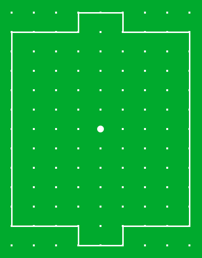

# Football Server

This repository contains the server code for the football game. Server accepts WebSocket connections as defined in the
[RFC-6455].

[RFC-6455]: http://tools.ietf.org/html/rfc6455

### Features

Currently, Football Server offers:

- Smooth and fast playing capabilities
- Lobby where clients can connect to and choose the opponent to play

### Project modules

Football Server repository is made of two modules:

- [api]
- [app]
- [auth]
- [domain]

The `domain` module is where the logic of the server is developed. The `api` module defines every object that the server
understands. Those objects are the API and must be used after successful connection to the server. The `app` module
contains the websocket server code and the main class to start the server. It also starts the second server (HTTP) from
the `auth` module. `auth` contains logic related to authorization. Please refer to the documentation of each module for
mode information.

[api]: ./api

[app]: ./app

[auth]: ./auth

[domain]: ./domain

### Football game

Football game is a great game without any age limit. It's fun and simple to play. There are existing clients that are
able to communicate with the server such as:

- [football-web]
- [football-desktop]

[football-web]: https://github.com/lipinskipawel/football-web

[football-desktop]: https://github.com/lipinskipawel/football-desktop
